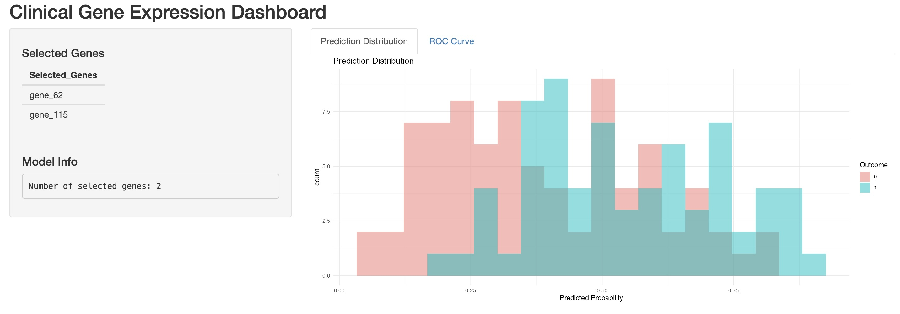
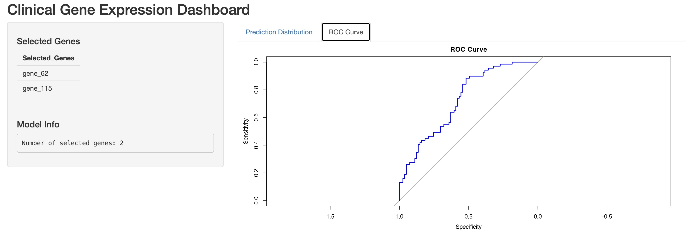

# Clinical Gene Expression Analysis

A complete end-to-end data science project simulating a clinical biomarker and gene expression study. This project demonstrates high-dimensional data analysis, feature selection, statistical modeling, and interactive visualization using R.

---

## Project Overview

This project replicates a real-world clinical data science workflow:

- Simulated **high-dimensional gene expression data** (500 genes)
- Combined with **clinical variables** (age, treatment, outcome)
- Applied **dimensionality reduction and feature selection**
- Built a **predictive logistic regression model**
- Developed an **interactive Shiny dashboard** for visualization

---

## Tech Stack

- **R**
- **tidyverse**
- **glmnet** (LASSO feature selection)
- **pROC** (ROC analysis)
- **shiny** (interactive dashboard)

---

## Workflow

### 1. Data Simulation
- Generated synthetic dataset with:
  - 150 patients  
  - 500 gene expression features  
  - Binary clinical outcome  

---

### 2. PCA Analysis
- Reduced dimensionality
- Explored variance structure
- Identified dominant patterns in gene expression

---

### 3. Feature Selection (LASSO)
- Applied LASSO regression (`glmnet`)
- Selected most predictive genes

 Selected genes:
- `gene_62`
- `gene_115`

---

### 4. Modeling
- Logistic regression using selected genes
- Model accuracy: **~0.61**

---

### 5. Shiny Dashboard

An interactive dashboard to explore model outputs and results.

---

## Dashboard Preview

### Prediction Distribution



---

### ROC Curve



---

## 📁 Project Structure
Clinical-Gene-Expression-Analysis/

-data/
  gene_expression_data.csv

-report/
  selected_genes.csv
  prediction_distribution.png
  roc_curve.png

-scripts/
  01-data-simulation.R
  02-pca-analysis.R
  03-feature-selection.R
  04-modeling.R

-functions/
  model_utils.R

-app.R
-README.md
---

## How to Run

### 1. Install dependencies

```r
install.packages(c("tidyverse", "glmnet", "pROC", "shiny"))
```
---
### 2. Run scripts
- source("scripts/01-data-simulation.R")
- source("scripts/02-pca-analysis.R")
- source("scripts/03-feature-selection.R")
- source("scripts/04-modeling.R")
---
### 3. Launch dashboard
- shiny::runApp()
